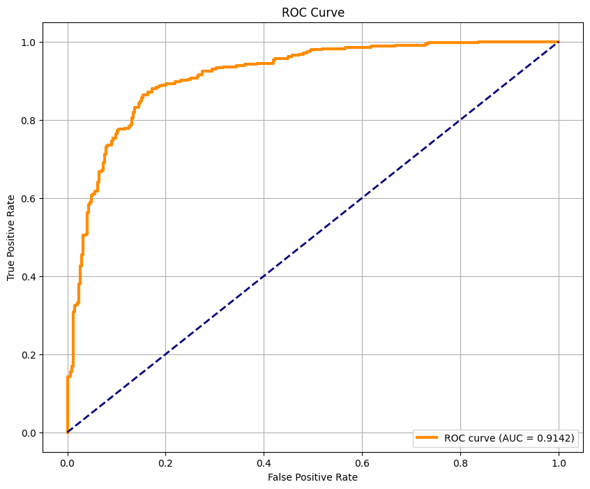

# 만선 - VAE 기반 낚시터 점수 제공 모델

본 프로젝트는 Variational Autoencoder(VAE)를 활용하여 **낚시 성공 확률이 높은 날의 기상 및 해양 데이터 패턴을 학습**하고, 이를 통해 특정 시점의 낚시터 환경이 얼마나 '성공적인 상황'과 유사한지를 점수(ELBO Score)를 현재 낚시터의 점수로 제공하는 이상치 탐지 모델 개발입니다.

- 어플리케이션에서 챗봇과 금일의 추천 낚시터를 지도에서 확인하는데 사용됩니다.

## 🎯 1. 프로젝트 목표 및 핵심 아이디어

### 목표
- **정량적 낚시터 평가**: 특정 낚시터의 기상/해양 데이터를 분석하여 '낚시 성공 확률'을 객관적인 점수로 제공합니다.
- **이상치 탐지**: 성공적인 낚시 환경의 데이터 분포에서 벗어나는, 즉 '낚시가 어려울 것으로 예상되는' 비정상적인 환경을 탐지합니다.

### 핵심 아이디어
VAE는 정상 데이터의 잠재적 특징(Latent Representation)을 학습하는 데 특화되어 있습니다.
1.  **학습**: '낚시 성공' 시점의 데이터만을 VAE에 학습시켜 '정상(Normal)' 데이터의 분포를 모델링합니다.
2.  **추론**: 새로운 데이터가 입력되면, 모델은 이를 압축 후 다시 복원합니다.
3.  **점수화**:
    - **정상 데이터**: 학습된 패턴과 유사하므로 원본과 가깝게 잘 복원됩니다 (낮은 복원 오차, 높은 ELBO 점수).
    - **비정상(이상치) 데이터**: 학습된 패턴과 다르므로 제대로 복원되지 못합니다 (높은 복원 오차, 낮은 ELBO 점수).

이 ELBO 점수를 **낚시터 성공 가능성 점수**로 활용합니다.

---

## 🚀 2. 모델 개발 및 최적화 여정

본 프로젝트는 총 3단계의 과정을 통해 모델을 발전시켰습니다.

### Phase 1: VAE 초기 모델 개발

#### 1.1. 데이터 전처리
모델의 성능을 극대화하기 위해 다음과 같은 체계적인 전처리 과정을 수행했습니다.
- **상관관계 분석**: 변수 간 상관관계를 분석하여 중복 정보를 가지는 피처를 제거했습니다.
- **다중공선성 제거 (VIF)**: VIF(분산 팽창 요인)를 통해 다변수 간 선형 관계를 파악하고, 노이즈 및 과적합 가능성을 줄였습니다.
- **상호작용 변수 생성**: 도메인 지식을 활용하여 비선형적 관계를 표현하는 상호작용 변수를 생성하고, 이를 통해 VIF 점수를 낮췄습니다.
- **주기적 특성 인코딩**: 물때, 시간, 계절 등 주기성을 가진 데이터는 Sin/Cos 변환을 적용하여 정보 손실 없이 모델에 제공했습니다.

#### 1.2. 초기 모델의 한계
- **정량적 성능 지표 부재**: ELBO, MSE 등 간접 지표만으로는 모델이 실제로 이상치를 얼마나 잘 탐지하는지 객관적으로 평가하기 어려웠습니다.
- **주관적 평가 의존**: 잠재 공간 시각화나 KL Divergence 값 해석은 개발자의 주관적 판단에 의존하는 한계가 있었습니다.
- **데이터 의존성**: 학습 데이터에 없는 새로운 성공 패턴에 대해서는 낮은 점수를 부여하는 문제가 있었습니다.      

---  

  

| 평가 지표 | 값 |
| :--- | :--- |
| 테스트 데이터 평균 재구성 오차 (MSE) | 0.415060 |
| 테스트 데이터 평균 KL 손실 | 5.433346 |
| 테스트 데이터 평균 ELBO | 6.025601 |
| 이상치 탐지 임계값 (95 퍼센타일) | 11.398485 |
| 탐지된 이상치 수 | 18/343 (5.25%) |

---

### Phase 2: VAE 모델 성능 분석 및 최적화

초기 모델의 한계를 극복하기 위해 평가 기준을 확립하고, 체계적인 최적화를 진행했습니다.

#### 2.1. 정량적 성능 평가를 위한 AUC 지표 도입
- **문제 정의**: 모델의 실제 이상치 탐지 성능을 객관적으로 측정할 기준이 필요했습니다.
- **해결 방안**:
    1.  정상 테스트 데이터의 피처 순서를 무작위로 섞어 **인위적인 이상치(Artificial Anomaly) 데이터를 생성**했습니다.
    2.  모델이 출력하는 ELBO 점수를 이용해 '정상'과 '인위적 이상치'를 얼마나 잘 분류하는지 **AUC(Area Under the ROC Curve)로 정량화**했습니다.
    3.  이를 통해 하이퍼파라미터 조합별 성능을 객관적으로 비교할 수 있는 신뢰성 있는 기준을 마련했습니다.

#### 2.2. 다층적 제약(Multi-layered Constraint) 완화를 통한 성능 최적화
- **가설**: Posterior Collapse 방지를 위해 적용했던 다층적 제약(`Beta`, `Free bits`, `Dropout` 등)이 누적되어 오히려 모델의 학습 능력을 과도하게 억제하고 있다는 가설을 수립했습니다.
- **실험 설계**: Grid Search를 통해 제약의 강도를 결정하는 `Beta`와 `Free bits`의 최적 조합을 체계적으로 탐색했습니다.
- **실험 결과**: KL Regularization 제약이 가장 약한 조합인 **`Beta=0.1`, `Free bits=0.0`에서 최적의 성능(테스트 재구성 오차 0.0445)을 달성**했습니다.
- **결론**: 과도한 제약을 완화하여 **Reconstruction과 Regularization 간의 최적 균형점**을 찾는 것이 성능 최적화에 결정적임을 확인했습니다. 안정성을 위한 구조적 제약은 유지하되, 불필요한 하이퍼파라미터 제약은 제거하는 것이 중요합니다.  

---  
### 하이퍼 파라미터 탐색

| 항목 | 값 |
| :--- | :--- |
| **최적화된 하이퍼파라미터** | |
| - Beta | 0.1 |
| - Free Bits | 0.0 |
| **테스트 성능** | |
| - 재구성 오차 (MSE) | 0.044519 |
| - 이상치 감지 임계값 (95 퍼센타일) | 1.764940 |
| - 감지된 이상치 수 | 18 / 343 |
| **ELBO 점수 통계** | |
| - 평균 | 0.8535 |
| - 표준편차 | 0.1111 |
| - 최솟값 | 0.0000 |
| - 최댓값 | 1.0000 |
| **하이퍼파라미터 탐색** | |
| - 최적 조합 (K-Fold 기준) | beta=0.1, free_bits=0.0 |
| - 해당 조합의 검증 손실 | 1.463805 |
---  

### 최적화 후 AUC

--- 

### Phase 3: Transformer-VAE 모델 도입

VAE의 성능을 한 단계 더 끌어올리기 위해 Self-Attention 메커니즘을 결합했습니다.

- **예상**: Transformer의 Multi-Head Attention 구조가 데이터 피처들 간의 복잡하고 비선형적인 관계를 더 효과적으로 포착할 것이라 예상했습니다.
- **실험 결과**:
    - 3-Fold 교차 검증을 통해 최적 하이퍼파라미터 조합을 탐색, 검증 데이터에서 **최대 0.9406의 평균 AUC**를 달성했습니다.
    - 최종 모델을 테스트 데이터로 평가한 결과, **최종 AUC Score 0.9334**라는 매우 높은 이상치 탐지 성능을 기록했습니다.
- **결론**: Transformer-VAE 모델이 피처 간의 복잡한 상호작용을 성공적으로 학습했으며, VAE에 Attention 메커니즘을 결합하는 것이 이상치 탐지 성능을 크게 향상시키는 효과적인 전략임을 실험적으로 증명했습니다.

---  

. 

| 항목 | 값 |
| :--- | :--- |
| **하이퍼파라미터 탐색** | |
| 최적 AUC (K-Fold 평균) | 0.940572 |
| beta_max | 0.01  |
| free_bits | 0.1 |
| **최종 모델 성능** | |
| 최종 모델 AUC (Test Set) | 0.933361 |
| 테스트 데이터 재구성 오차 (MSE) | 0.132720 |
| 이상치 탐지 임계값 (95 퍼센타일) | 0.506368 |
| 감지된 이상치 수 (Test Set) | 18 / 343 |
---

## 📊 3. 최종 성능 요약

| 모델 | 주요 지표 | 값 | 비고 |
| :--- | :--- | :--- | :--- |
| **Transformer-VAE** | **Test AUC Score** | **0.9334** | 가장 높은 이상치 탐지 성능 |
| Transformer-VAE | Test MSE | 0.1327 | 복원 오차 |
| Optimized VAE | Test MSE | 0.0445 | 제약 완화 후 성능 |
| Initial VAE | - | - | 정성적 평가 위주 |

---

## 🚧 4. 한계점 및 향후 과제

-   **데이터 의존성**: 현재 모델은 학습된 데이터의 패턴에 강하게 의존합니다. 실제 사용자들의 조과(낚시 성공 여부) 데이터를 지속적으로 수집하여 모델을 점진적으로 개선(Fine-tuning)하는 파이프라인 구축이 필요합니다.
-   **정량적 지표 탐색**: AUC 외에, 실제 비즈니스 문제에 더 적합한 정량적 성능 지표를 추가적으로 탐색하고 도입할 필요가 있습니다.
---

 
 
 

# 챗봇 (ChatBot)

자연어 질문을 통해 사용자에게 맞춤형 낚시 정보를 제공하는 AI 챗봇.  
사용자의 위치, 특정 지명, 날짜 등을 기반으로 최적의 낚시 포인트와 관련 해양 데이터(날씨, 수온, 조위, 파고 등)를 추천합니다.

## ✨ 주요 기능

- **위치 기반 추천**: 사용자의 현재 위치 또는 특정 지명을 기준으로 가장 가까운 낚시 포인트 추천
- **상세 정보 제공**: 특정 날짜의 날씨, 수온, 조위, 낚시 점수 등 상세 정보 조회
- **광역 검색**: '동해', '서해', '남해' 등 넓은 해역을 기준으로 정보 검색
- **자연어 이해**: "어제", "내일", "3일 후" 등 자연어 날짜를 해석하여 정확한 시점의 데이터 조회

## 🛠️ 기술 스택

- **Backend**: FastAPI
- **LLM**: OpenAI GPT-4o-mini
- **LLM Framework**: **LangChain & LangGraph** (ReAct Agent)
- **Database**: MySQL (`pymysql`)
- **Core Libraries**: SQLAlchemy, Pydantic, Uvicorn, python-dotenv, requests, haversine
- **External API**: Google Geocoding API

## 🏛️ 아키텍처 및 동작 흐름

이 시스템은 **LangGraph**를 사용하여 ReAct(Reasoning and Acting) 로직을 구현한 에이전트를 중심으로 동작합니다. LangGraph는 LangChain의 확장 라이브러리로, LLM 에이전트의 작업 흐름을 상태를 가진 '그래프(Graph)' 형태로 정의하여 더 복잡하고 제어 가능한 순환(Cyclic) 로직을 구현할 수 있게 해줍니다.

### 에이전트 응답 생성 순서도

아래 순서도는 사용자의 질문 유형에 따라 에이전트가 어떻게 분기하여 작업을 처리하는지 보여줍니다.

### 동작 과정

1.  **요청 수신 (Request)**: 사용자가 자연어 질문과 위치 정보를 FastAPI 서버(`POST /api/fishing/recommendation`)로 전송합니다.
2.  **에이전트 준비 (Agent Setup)**: 서버는 요청 정보를 바탕으로 동적 도구(사용자 위치)를 생성하고, 이를 SQL 및 기타 범용 도구와 결합합니다.
3.  **LangGraph 실행 (Graph Execution)**: `create_react_agent`로 생성된 LangGraph 에이전트가 실행됩니다.
    - **🤔 생각 (Thought)**: 에이전트는 사용자의 질문과 시스템 프롬프트의 지침을 바탕으로 문제 해결 계획을 수립합니다.
    - **🎬 행동 (Action)**: 계획에 따라 필요한 도구(e.g., 날짜 계산, 지오코딩, SQL 쿼리)를 실행합니다.
    - **👀 관찰 (Observation)**: 도구 실행 결과를 관찰하고 다음 행동을 결정합니다.
    - **🔄 반복 (Cycle)**: LangGraph의 순환 구조 덕분에, 에이전트는 최종 답변을 얻을 때까지 '생각-행동-관찰' 사이클을 반복합니다.
4.  **응답 생성 (Response)**: 에이전트가 최종 답변을 생성하면, 서버는 이를 JSON 형식으로 사용자에게 반환합니다. 시스템 프롬프트의 지시에 따라, 내부 작업 과정은 숨기고 최종 결과만을 정확하게 전달합니다.

## 🧠 시스템 프롬프트의 핵심 전략

이 프로젝트의 성능은 **정교하게 설계된 시스템 프롬프트**에 크게 의존합니다. 프롬프트는 LLM 에이전트에게 다음과 같은 핵심 전략을 지시합니다.

1.  **역할 부여**: "대한민국 낚시 추천 전문 AI 어시스턴트"라는 명확한 역할을 부여하여 응답의 톤앤매너를 일관되게 유지합니다.
2.  **명확한 작업 지침**: 질문 유형에 따라 따라야 할 **알고리즘을 순차적으로 명시**하여 LLM의 추론 과정을 안내합니다.
    - **특정 위치 기반 질문**: `지오코딩 -> 가장 가까운 포인트 ID 검색 -> 해당 ID로 정보 조회`라는 **2단계 쿼리 전략**을 강제하여 정확도를 높입니다.
    - **해역 기반 질문**: 별도 도구 없이, 미리 정의된 위도/경도 범위로 `WHERE` 절을 직접 구성하도록 하여 쿼리 효율을 최적화합니다.
3.  **DB 스키마 설명**: 복잡한 테이블 관계와 `JOIN` 방법을 자연어로 설명하여 LLM이 복잡한 SQL 쿼리를 생성할 수 있도록 돕습니다.
4.  **응답 제약**: 내부 작업 과정(사용한 도구, 중간 단계 등)을 노출하지 않고, 최종 결과만을 사용자 친화적으로 전달하도록 엄격히 지시합니다.

## 📈 잠재적 개선 사항

-   **응답 캐싱**: 동일한 질문에 대해 LLM 호출 및 DB 쿼리 결과를 캐싱하여 비용을 절감하고 응답 속도를 향상 가능 (e.g., Redis 사용)
-   **대화형 컨텍스트 관리**: LangGraph의 상태 관리(State Management) 기능을 더 깊이 활용하여 여러 턴에 걸친 대화의 맥락을 기억 가능.
-   **스트리밍 응답**: `StreamingResponse`를 사용하여 긴 답변을 실시간으로 스트리밍하여 사용자 경험(UX)을 개선 가능
-   **고급 오류 처리**: 도구 실행 실패 시(예: 지오코딩 실패) 더 정교한 재시도 로직이나 사용자에게 대안을 제시하는 로직을 추가 가능

---